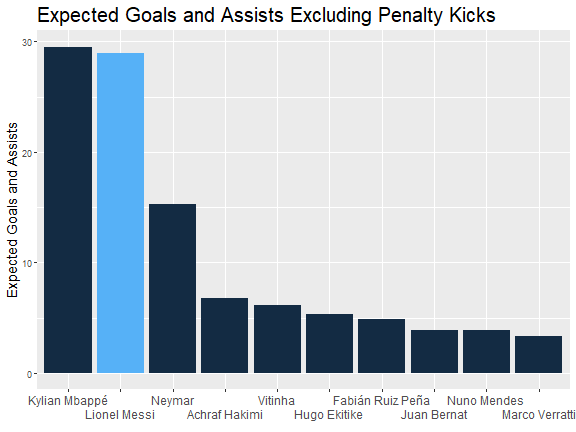

> &nbsp;이강인의 PSG 데뷔전. 많은 관심이 이강인과 곤살로 라모스에게 맞춰진 가운데 리그앙 시즌 첫번째 경기가 열렸다. 리오넬 메시를 떠나보낸 루이스 엔리케 감독이 이강인과 라모스에게 원하는 건 무얼까? 그리고 이번 시즌, 그 두 선수는 감독의 기대를 넘는 퍼포먼스를 보여줄 수 있을까?

* * *
## 메시의 큰 빈자리

&nbsp;이제는 노장이라고 할 만한 나이에도 메시는 지난 시즌 PSG에서 맹활약을 펼쳤다. 예전보다는 민첩성이라든가 순발력이 조금 떨어지고 근력도 저하된 모습이지만 전보다 훨씬 향상된 판단력으로 나이를 극복해낸 모습이다. 이런 메시의 퍼포먼스는 숫자에서 그대로 나타난다. 리그앙 경기 중 31.5경기 정도를 소화한 메시는 총 1600개의 패스를 기록했다. 또 슈팅으로 이어진 패스를 말하는 ``Key Pass`` 부분에서도 무려 경기당 2개를 기록했다. 당연히 팀 내에서도 최상위권이다. 비교하자면 토트넘의 해리 케인은 2022/23 시즌에 1.6개의 key pass를 기록했다.

&nbsp;이 메시의 역할을 이제는 이강인과 라모스가 떠맡게 되었다. 부담스럽지 그지 없다. 하지만 이강인의 마요르카에서의 활약을 감안하면 충분히 가능하리라 본다. 특히 PSG 동료들의 서포트가 더 강력할 것이기에 더 많은 볼을 잡게 될 것이고 이강인의 장점이 더욱 부각될 것이라 믿는다.
* * *
## 메시가 진정한 키플레이어였던 이유

&nbsp; 메시는 2022/23 시즌 xG와 xAssist를 거의 30개에 가깝게 기록했다. 메시보다 유일하게 높은 수치를 기록한 선수는 음바페 뿐이다. 최근 뉴스의 흐름을 보면 PSG에 잔류하는 것 처럼 보이지만 앞으로 어떻게 일이 흘러갈 지는 아무도 모른다. 만약 PSG가 음바페와 메시, 그리고 어쩌면 네이마르까지 잃게 되면 PSG는 이번 시즌 큰 어려움을 겪게 될 것이다.
* * *

## 로리앙과의 경기에서 보여준 PSG의 공격력

&nbsp; 이런 상황에서 PSG는 시즌 첫 경기를 치뤘다. 메시와 네이마르, 음바페가 없는 경기에서 역시나 전혀 득점을 올리지 못한 채 0:0 무승부로 경기는 종료됐다. 상대가 지난 시즌 중위권을 기록한 로리앙이라는 걸 감안하더라도 다소 실망스럽다. 그나마 긍정적인 건 하키미와 라모스, 솔레르가 비교적 많은 공격포인트를 기록했고 이강인도 훌륭하진 못했지만 준수한 경기를 펼쳤다. **각 상황에서의 득점, 어시스트로 연결될 기대값을 나타내는** ``expected goal과 assists``로 봐도 공격진의 모든 선수들이 골고루 활약했다.
* * *

## 많은 슛팅을 기록하긴 했지만...

&nbsp; PSG는 많은 슛팅을 기록하긴 했지만 저퀄리티의 슛팅을 기록하며 득점을 올리지 못했다. xG 0.2 이하의 슛팅이 대부분이었다. 100번 정확히 같은 상황에서 슛팅을 하면 20번 정도만 골로 연결될 퀄리티의 찬스였다는 것. 위 그림에서 보다시피 페널티 박스 밖일수록, 측면일수록 xG 값은 급격히 떨어진다. 물론 손흥민 선수와 같이 슛팅이 매우 날카롭고 자신이 있는 경우 각이 없는 상황에서도 곧잘 골을 기록하곤 하지만 손흥민은 슛팅이 너무 좋으므로 예외다. 일반적으로는 골대 정면과 페널티박스 밖인 경우, 웬만큼 기회가 좋지 않는 이상 슛을 하면 안된다. 더 좋은 위치에 있는 선수에게 패스해야 한다.

&nbsp; 그런데 PSG는 이번 개막전에서 저퀄리티의 슛팅만 무려 20개를 기록하며 득점을 기록하지 못했다. 단순히 슛팅의 숫자가 많다고 무조건 좋은 것만은 아닌 것.

* * *

## 이강인의 장점이 돋보이긴 했다.

&nbsp; 위 표는 이 경기에서의 ``Progressive Carry``횟수를 나타낸 것인데, 이강인이 팀내 3위다. ``Progressive Carry``란 볼을 10야드 이상 드리블을 통해 전진시킨 경우다. 10야드는 약 9.15미터로 프리킥으로부터 벽까지와의 거리다. 역시나 믿음직한 윙백 하키미가 가장 많은 캐리를 기록했고 뜻밖에도 중앙 수비수 다닐로, 그리고 3위가 이강인이다. Final third로의 패스의 경우 이강인 선수가 부진했는데, 아마 이강인의 스루패스를 받아줄 만한 PSG 선수가 없었기 때문이 아닐까 싶다. 음바페나 네이마르가 경기에서 함께 뛰게 된다면 이강인에게 조금 더 패스 기회가 많이 생기지 않을까?
* * *
## 결론
&nbsp; 이강인 선수 입장에서는 무난한 경기였다. 다만 PSG 입장에서는 조금 아쉽다. 메시와 음바페, 네이마르의 공백을 여실히 보여줬기 때문이다. 하지만 아직 평가하긴 이르다. 팀에 적응하는데 아무리 못해도 6개월의 시간은 줘야한다. 이강인 선수는 벌써 꽤나 잘 적응한 듯 싶지만, 곤살로 라모스는 아직이다. 표정도 자신없어 보이고 슛팅도 자심감이 결여된 모습이었다.

&nbsp; 그러나 점점 시간이 지나며 나아질 것. 특히 네이마르, 음바페 중 한 선수라도 PSG에 잔류하게 되면 이강인 선수와의 케미가 어떻게 발현될 지 기대하지 않을 수 없다.
